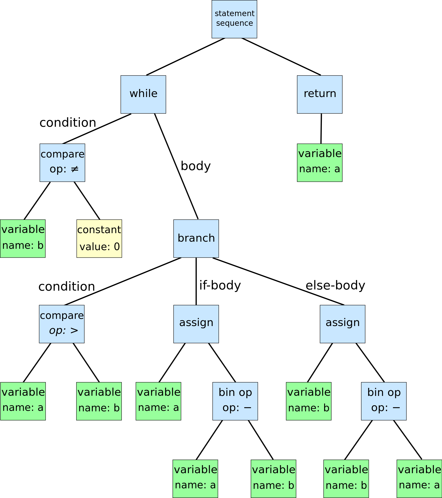
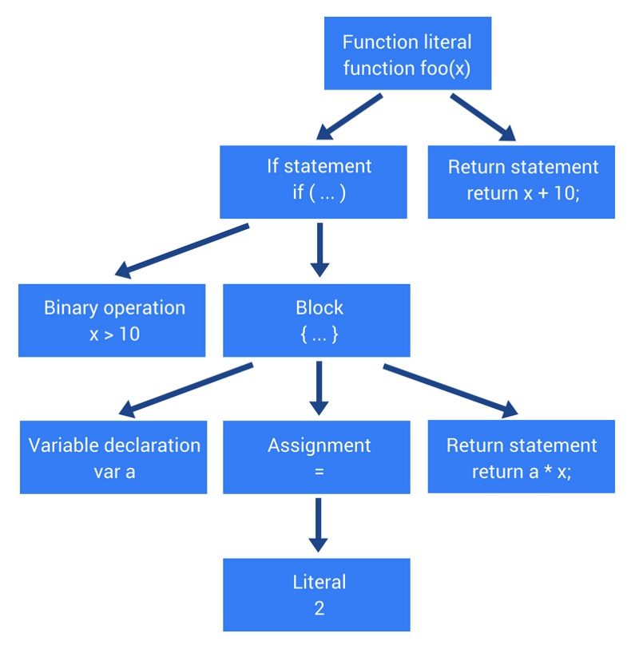
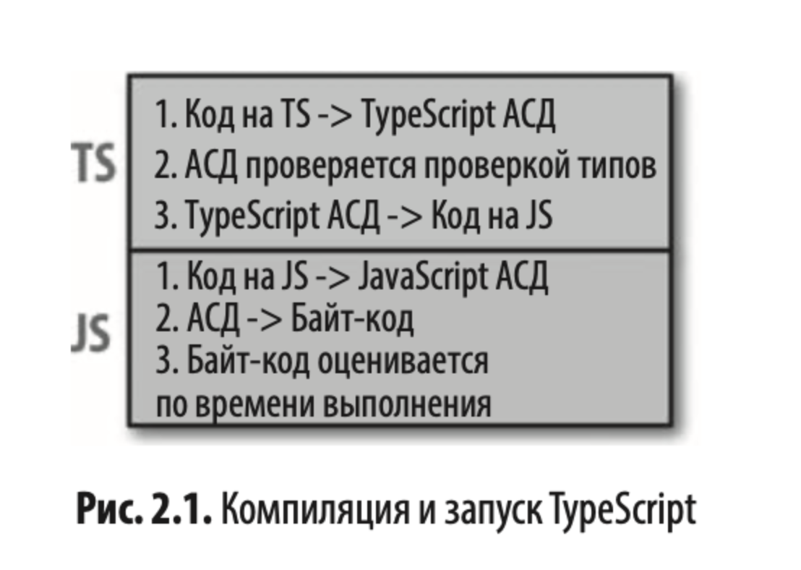

# Typescript-study day
TSC - Typescript compiler\
\
Стадии работы компилятора:
1. Программа преобразуется в AST.
2. AST компилируется в байт-код.
3. Байт-код считывается средой выполнения.
### AST(Abstract syntax tree) -
это дерево, которое в абстрактном виде представляет структуру программы. AST создаётся парсером по мере синтаксического разбора программы.\
\
Example\
\
Code(Euclidean algorithm):
```
while b ≠ 0:
    if a > b:
        a := a - b
    else:
        b := b - a
return a
```
AST:\
\
<br />

Absctract syntax tree for a js function -\
\
Code:
```
function foo(x) {
    if (x > 10) {
        var a = 2;
        return a * x;
    }

    return x + 10;
}
```
AST:\
\

